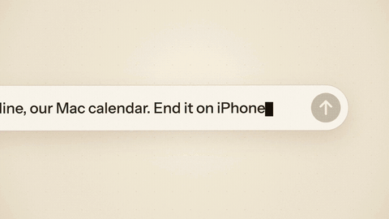
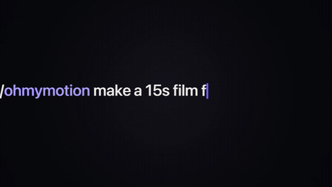
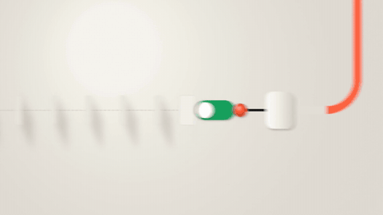
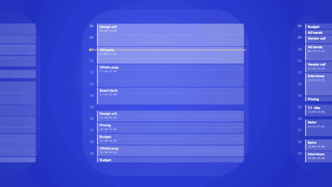
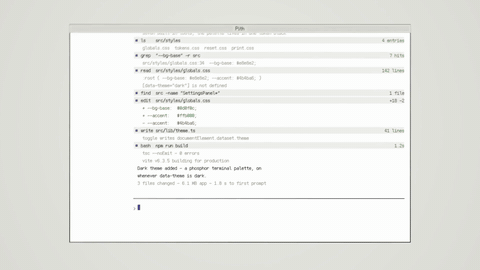
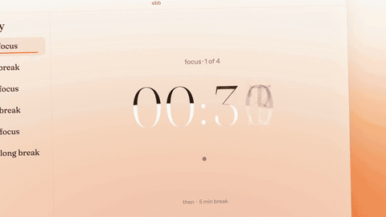
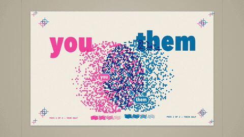
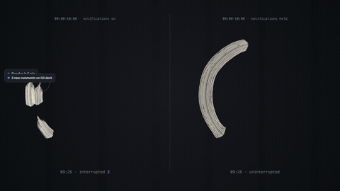
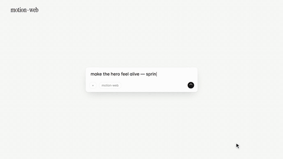
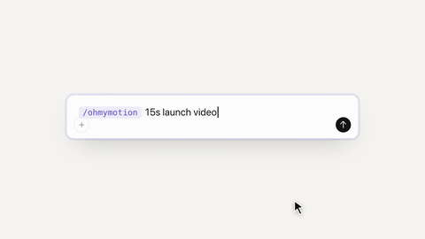

# onetake

> **Motion films that never cut to the next slide.** A Claude Agent Skill that makes product launch films, teasers and feature demos where every beat grows out of the one before — one continuous take, not a stack of scenes.
> **一镜到底的连贯动效。** 做产品发布片、预告片、功能演示：每一个画面都从上一个画面里长出来，是一整条连续的镜头，而不是一张张轮流出场的"PPT"。

[](LICENSE)
[](SKILL.md)
[](cases/)
[](scripts/verify_promo.py)


<sub>From onetake's own launch film. A prompt bar opens into the ad it asked for; the next prompt collapses into a line that shoots across the desk and opens into a festival screen. No cut. [Full film with sound →](cases/onetake-launch-30s/onetake-launch.mp4)</sub>

---

[English](#english) | [中文说明](#chinese)

---

<a name="english"></a>
## English

### The problem: motion that falls apart

Most motion videos an AI makes today — and most template tools — come out **loose**. Title card, fade, UI shot, fade,
feature card, fade, logo. Each shot can look fine and the whole still reads like a slideshow, because nothing
connects one beat to the next: scenes *replace* each other.

### What onetake does differently: every beat is carried

onetake treats the boundary between two beats as the thing to design. At every boundary, **something on screen
survives and visibly becomes the next beat**:

- the prompt bar **opens into** the app window; the window **reflows into** the phone;
- a bar **collapses into a line**, the line **shoots across** the desk and **becomes the first grid line** of the next film;
- a card **grows into** the page; a stage **opens from** the character; the camera **pushes through** a card until it *is* the next scene;
- at the end, the cast **folds into** the lockup — in the launch film, the block cursor **writes the name** in one stroke.

And **one camera holds it all together**. It never cuts: it follows the subject a beat ahead, whips to where the next
thing will land, floats like a hand-held operator and shakes when something hits — then holds dead still, because rests
are what make the moves land.

### Continuity is measured, not hoped for

Every film is checked by an oracle before a human watches it. `probe.py` records what is on screen in every frame, finds
each boundary, and asks what carried across it. A film whose beats replace each other fails.

| film | verdict | continuity (carry score) |
|---|---|---|
| an earlier launch film, v1 — perfect rhythm, still a slideshow | rejected | **0.00** |
| the same film, v2 | rejected | **0.40** |
| the same film, v3 — every beat grows out of the last | accepted | **0.75** |
| onetake launch film | accepted | **0.83** |

The same oracle fails uniform cadence (shots all the same length), no stillness, clipped audio, fast moves without
motion blur, and a subject that leaves the frame.

### What makes it look finished

- **Real UI, rebuilt.** The product's interface is rebuilt in HTML from screenshots and sits on the camera's plane, so the camera can fly into it at any zoom. No screen recording.
- **Measured moves.** ~38 moves (springs, entrances, carries, contact, sims, camera, fluid grounds), each a pure function of time with its speed curve measured — never a hand-rolled ease.
- **Real motion blur.** Every moving frame is several captures across an open 180° shutter, averaged in linear light. Fast moves smear instead of strobing.
- **Sound in one room.** Foley and synthesis placed from the film's own events, in one reverb, ducking the music under the hits.
- **Deterministic.** Seek to any time, get the same frame. Drafts at 1080p30, finals at 4K60.

### 🌟 Films made with it

Every case ships the finished film and a breakdown (concept, beat sheet, numbers, what was rejected and why). The
films' source code is not included.

<table>
  <tr>
    <td width="50%" align="center"><b>onetake launch</b><br/><br/>
      <sub>Three prompts, three films, one take — each prompt visibly becomes its film</sub><br/>
      <a href="cases/onetake-launch-30s/onetake-launch.mp4">▶ Film</a> | <a href="cases/onetake-launch-30s/README.md">📖 Breakdown</a></td>
    <td width="50%" align="center"><b>one-dot</b><br/><br/>
      <sub>One dot is the whole film: caret → menu → loading ring → spring curve → the dot on the i</sub><br/>
      <a href="cases/one-dot-15s/one-dot.mp4">▶ Film</a> | <a href="cases/one-dot-15s/README.md">📖 Breakdown</a></td>
  </tr>
  <tr>
    <td align="center"><b>knockon</b><br/><br/>
      <sub>A chain reaction: every beat is the collision that starts the next</sub><br/>
      <a href="cases/knockon-15s/knockon.mp4">▶ Film</a> | <a href="cases/knockon-15s/README.md">📖 Breakdown</a></td>
    <td align="center"><b>clearing</b><br/><br/>
      <sub>One zoom from a year to a free half hour — 1× to 300× and back, never a cut</sub><br/>
      <a href="cases/clearing-15s/clearing.mp4">▶ Film</a> | <a href="cases/clearing-15s/README.md">📖 Breakdown</a></td>
  </tr>
  <tr>
    <td align="center"><b>pith</b><br/><br/>
      <sub>The window grows out of one phosphor pixel: 440× → 0.52× in one move</sub><br/>
      <a href="cases/pith-21s/pith.mp4">▶ Film</a> | <a href="cases/pith-21s/README.md">📖 Breakdown</a></td>
    <td align="center"><b>ebb</b><br/><br/>
      <sub>A field of light carries the take through five places; each flood drains onto the next</sub><br/>
      <a href="cases/ebb-15s/ebb.mp4">▶ Film</a> | <a href="cases/ebb-15s/README.md">📖 Breakdown</a></td>
  </tr>
  <tr>
    <td align="center"><b>overlap</b><br/><br/>
      <sub>Two print passes slide into register — and an & appears that was hidden in both</sub><br/>
      <a href="cases/overlap-15s/overlap.mp4">▶ Film</a> | <a href="cases/overlap-15s/README.md">📖 Breakdown</a></td>
    <td align="center"><b>unbroken</b><br/><br/>
      <sub>One ink stroke that is never lifted: procedural brush, no textures</sub><br/>
      <a href="cases/unbroken-15s/unbroken.mp4">▶ Film</a> | <a href="cases/unbroken-15s/README.md">📖 Breakdown</a></td>
  </tr>
  <tr>
    <td align="center"><b>motion-web</b><br/><br/>
      <sub>Where the rhythm rules came from: small UI, big ground, rests, then a burst</sub><br/>
      <a href="cases/motion-web-15s/motion-web.mp4">▶ Film</a> | <a href="cases/motion-web-15s/README.md">📖 Breakdown</a></td>
    <td align="center"><b>skill-demo</b><br/><br/>
      <sub>An operation demo from nothing: the chosen menu row flies into the input as a chip, and on from there</sub><br/>
      <a href="cases/skill-demo-15s/skill-demo.mp4">▶ Film</a> | <a href="cases/skill-demo-15s/README.md">📖 Breakdown</a></td>
  </tr>
</table>

> one-dot and skill-demo were made when the skill was still called *ohmymotion*; the films show that name.

### How a film is made

1. **Deconstruct the reference in numbers:** how much of it is still, where it cuts, how its moves ease.
2. **Three concepts, pick one.** Each is one sentence about the *picture* — "one dot becomes everything", "one zoom through scale" — not three stories told with the same cards.
3. **A beat sheet for rhythm *and* carry.** Shot lengths vary by ≥ 4×, and every boundary names what survives it.
4. **Compose** one HTML file on the move library. **Render** with motion blur. **Score** the sound from the film's events.
5. **Verify**, then show a human.

### 📦 Installation

```bash
# Claude Code
git clone https://github.com/feitangyuan/onetake.git ~/.claude/skills/onetake
# Codex / other agents that read skills
git clone https://github.com/feitangyuan/onetake.git ~/.agents/skills/onetake
```

Then ask: *"Make a 15 s launch video for my app"*, *"a feature demo rebuilt from these screenshots, no screen
recording"*, *"my motion video feels like a slideshow — fix it"*.

**Requires** python3 with `playwright` (chromium), `numpy`, `scipy`, `Pillow`, `matplotlib` (`opencv-python` for
reference analysis), `ffmpeg`, `node`. Narration adds `faster-whisper` and Kokoro TTS. Music is royalty-free by default.

| | |
|---|---|
| `SKILL.md` | the protocol and the hard rules each rejected cut taught |
| `lib/motion.js` · `lib/ui_kit.js` | the move library; the UI-rebuild kit |
| `scripts/` | render (motion blur, 4K60), verify (the oracle), probe, stills, reference analysis, footage, narration, sound |
| `gallery/` | one live demo and one six-frame sheet per move |
| `references/` | rhythm, carry, composition, camera, sound, product demos — the method with its numbers |

### License

[PolyForm Noncommercial 1.0.0](LICENSE): free for personal, educational, research and other noncommercial use.
**Commercial use is not permitted.**

---

<a name="chinese"></a>
## 中文说明

### 问题：动效是散的

现在大多数 AI 做出来的动效视频，还有大多数模板工具做出来的，都是**散的**。
标题卡、淡出、界面镜头、淡出、功能卡片、淡出、Logo。每一镜单看也许都不错，合起来还是像在翻 PPT。
原因是画面和画面之间没有任何联系，后一个场景只是把前一个**替换**掉了。

### onetake 不一样：每个画面都被"接住"

onetake 把两个画面之间的交接处当成设计的重点。每一个交接处，**都有一个东西活下来，并且看得见地变成下一个画面**：

- 输入框**展开成** App 窗口，窗口再**重排成**手机界面；
- 输入框**压成一条线**，这条线**划过桌面**，**变成**下一条片子的第一根网格线；
- 卡片**长成**整个页面；舞台从角色身上**打开**；镜头**穿过**一张卡片，穿过去就是下一个场景；
- 结尾，所有元素**收拢成**标志。在 onetake 自己的发布片里，是光标一笔**写出**名字。

**把这一切串起来的是同一个镜头。** 它从不剪断：提前半拍跟着主体走，抢在下一个东西落地前甩过去，像手持一样轻微浮动，东西撞上来时跟着一震；
该停的时候又能完全静止，因为有停顿，动作才落得下来。

### 连贯是量出来的，不是靠感觉

每条片子给人看之前，先过一遍自动验收。`probe.py` 记录每一帧画面上有什么，找出每一个交接处，再判断有没有东西从这边带到那边。
画面互相替换的片子，直接判不合格。

| 片子 | 结果 | 连贯度（carry score） |
|---|---|---|
| 更早的一条发布片 v1：节奏完美，仍然像 PPT | 被否 | **0.00** |
| the same film, v2 | 被否 | **0.40** |
| 同一条片子 v3：每个画面从上一个里长出来 | 通过 | **0.75** |
| onetake 发布片 | 通过 | **0.83** |

同一套验收还会判掉这些问题：镜头长度全都一样、没有静止段落、音频爆音、快动作没有运动模糊、主体出画。

### 为什么看起来像成品

- **复刻的真实界面**：按截图用 HTML 重建产品界面，放在镜头所在的平面上，推到多近都清楚，不需要录屏。
- **实测过的动作**：约 38 个动作（弹簧、入场、衔接、碰撞、物理模拟、镜头、流体光场），每个都是时间的纯函数，速度曲线都实测过，不用随手写的缓动。
- **真实运动模糊**：每个运动帧都是快门张开期间的多次采样，在线性光下平均。快动作会拖出残影，而不是一格一格地闪。
- **同一个空间里的声音**：音效按片子里的事件摆放，放在同一个混响里，打点的地方音乐自动让位。
- **结果确定**：跳到任意时间，得到的都是同一帧。草稿 1080p30，成片 4K60。

### 案例

上面的表格里有 10 条用它做的片子，每条都附成片和拆解文档（概念、节拍表、数据、被否掉的版本和原因）。**不包含片子的源代码。**
其中 one-dot 和 skill-demo 做的时候 skill 还叫 *ohmymotion*，画面里是旧名字。

### 一条片子怎么做出来

1. **先把参考片拆成数字**：静止占多少、在哪里剪、动作怎么缓动。
2. **出三个概念，选一个**：每个概念是一句关于画面的话，比如"一个点变成一切""一个镜头穿过所有尺度"，而不是同一套卡片换三种讲法。
3. **写节拍表，节奏和衔接都要写**：镜头长短相差 4 倍以上，每个交接处都写明是什么东西活下来。
4. **合成、渲染、配音**：在动作库上写一个 HTML 文件，带运动模糊渲染，按片子里的事件配声音。
5. **过验收，再给人看。**

### 安装

```bash
# Claude Code
git clone https://github.com/feitangyuan/onetake.git ~/.claude/skills/onetake
# Codex 等读取 skills 的 Agent
git clone https://github.com/feitangyuan/onetake.git ~/.agents/skills/onetake
```

然后直接说：「给我的 App 做个 15 秒发布视频」「按这几张截图复刻界面做功能演示，不录屏」「我的动效视频像 PPT，帮我改」。

**依赖**：python3（`playwright` + chromium、`numpy`、`scipy`、`Pillow`、`matplotlib`，分析参考片需要 `opencv-python`）、`ffmpeg`、`node`。
配音需要 `faster-whisper` 和 Kokoro TTS。音乐默认用免版权曲库。

### 许可证

[PolyForm Noncommercial 1.0.0](LICENSE)：个人、学习、研究等**非商业用途免费使用，不允许商用**。
